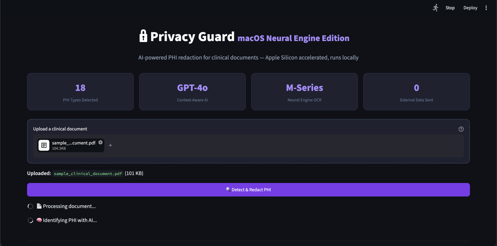
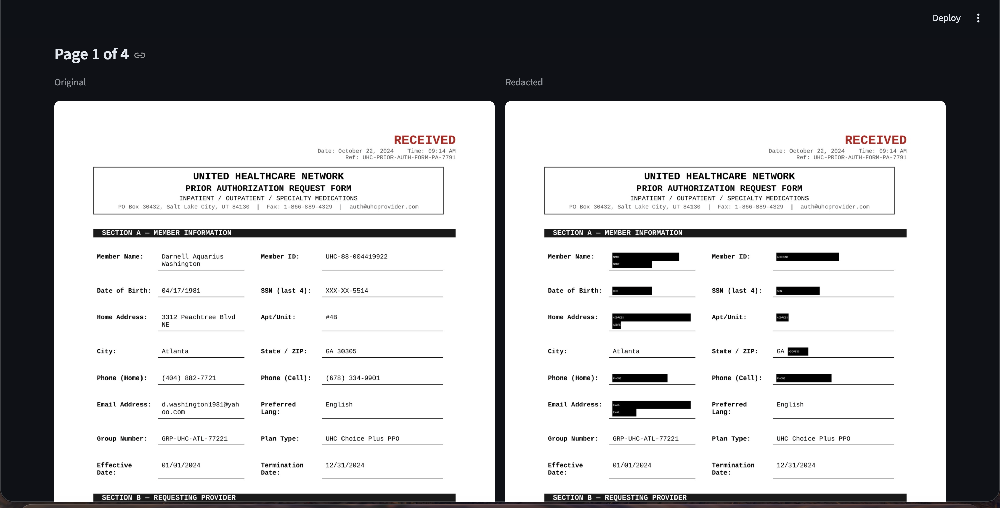

# 🔒 Privacy Guard

> AI-powered PHI redaction for clinical documents — built for healthcare compliance

[](https://python.org)
[](https://streamlit.io)
[](https://openai.com)
[](LICENSE)

## What It Does

Privacy Guard automatically detects and redacts **Protected Health Information (PHI)**
from clinical documents — discharge summaries, prior authorization forms, lab reports,
insurance claims, and more.

Upload a PDF → AI identifies patient PHI → Precise redaction → Download clean document.



---

## The Problem

Healthcare organizations process millions of clinical documents containing sensitive
patient data. Before sharing these documents with third-party reviewers, offshore coders,
or AI models, PHI must be stripped out. Manual redaction is slow, expensive, and
error-prone. Existing tools use rigid pattern matching that can't distinguish a patient's
phone number from a physician's direct line.

**Privacy Guard solves this with context-aware AI.**

---

## How It Works

```
Document Upload (PDF/Image)
        ↓
Apple Vision Neural Engine (M-Series)
— OCR extracts all text with precise coordinates
        ↓
GPT-4o-mini Stage 1: Global Context Extraction
— Identifies: document type, facility, patient name,
  physician names, facility phone numbers
        ↓
GPT-4o-mini Stage 2: Per-Page PHI Detection
— Uses extracted context to identify ONLY patient PHI
— Knows "Dr. Sarah Chen" is a physician, not a patient
— Knows "(503) 922-4400" is a facility number, not patient's phone
        ↓
Tri-Tier Visual Redaction Engine
— Strategy 1: PyMuPDF exact text layer search
— Strategy 2: Sliding window for split-line text
— Strategy 3: Global PHI persistence across all pages
        ↓
Download Redacted PDF
```

---

## Key Features

**Context-Aware AI Detection**
- Two-stage GPT pipeline understands document structure
- Distinguishes patient PHI from physician info, facility data, and clinical codes
- Works on any clinical document type without hardcoded rules

**Precise Redaction**
- PyMuPDF text-layer search for pixel-perfect placement
- Handles PHI split across multiple lines (emails, addresses)
- Global PHI persistence — name redacted on page 1 is redacted on page 5 too
- Address breakdown: street, apt, and ZIP redacted separately

**HIPAA-Conscious Design**
- No raw document images sent to external services
- Only OCR-extracted text strings sent to OpenAI
- Audit log records redaction metadata only — never PHI content
- All image processing happens locally on device

**What Gets Redacted**
| Category | Examples |
|----------|---------|
| NAME | Patient name, emergency contact name |
| SSN | 523-67-4891 |
| DOB | 07/22/1964 |
| ADDRESS | Street number + name, apt number, ZIP code |
| PHONE | Personal phones (not facility numbers) |
| EMAIL | Personal emails (not institutional domains) |
| ACCOUNT | Billing accounts, portal IDs, member IDs |
| POLICY | Insurance policy and group numbers |
| MEDICARE | Medicare beneficiary ID |
| CREDIT_CARD | Card on file references |
| EMPLOYER | Employer name and address |

**What Stays Visible**
- Physician names and credentials
- Hospital/facility names and addresses
- NPI numbers, CPT codes, ICD-10 codes
- Dates of service, admission dates
- Medications, lab values, diagnoses
- Billing totals and insurance company names

---

## Tech Stack

| Component | Technology | Purpose |
|-----------|-----------|---------|
| UI | Streamlit | Web interface |
| OCR | Apple Vision (M-Series Neural Engine) | Text extraction from documents |
| PHI Detection | OpenAI GPT-4o-mini | Context-aware identification |
| PDF Processing | PyMuPDF (fitz) | Text search + redaction |
| Image Processing | OpenCV | Frame handling |
| Environment | Python 3.11+, macOS Apple Silicon | Runtime |

---

## ⚠️ Platform Requirements

**This application runs on macOS with Apple Silicon only.**

The OCR engine uses Apple's native Vision framework (`pyobjc-framework-Vision`),
which is built into macOS and uses the M4 Neural Engine for fast, accurate text
extraction. It does not run on Windows or Linux.

Tested on: macOS Sonoma 14+ with Apple M4

---

## Setup & Installation

### Step 1 — Clone the repository

```bash
git clone https://github.com/Atharva309/Privacy-Guard
cd Privacy-Guard
```

### Step 2 — Create a virtual environment

```bash
python3 -m venv venv
source venv/bin/activate
```

### Step 3 — Install dependencies

```bash
pip install -r requirements.txt
```

### Step 4 — Get an OpenAI API key

This app uses OpenAI's `gpt-4o-mini` model to identify PHI in documents.
You need an API key to use it.

1. Go to [platform.openai.com](https://platform.openai.com)
2. Sign in or create an account
3. Navigate to **API Keys** → **Create new secret key**
4. Copy the key — it starts with `sk-`

> Cost: processing one 3-page clinical document costs approximately $0.001
> (less than a tenth of a cent) using gpt-4o-mini.

### Step 5 — Add your API key

Create a `.env` file in the project root:

```bash
cp .env.example .env
```

Open `.env` in any text editor and replace the placeholder with your key:

```
OPENAI_API_KEY=sk-your-actual-key-here
```

Save the file. **Never commit this file to git** — it is already in `.gitignore`.

### Step 6 — Run the app

```bash
streamlit run app.py
```

The app will open automatically at **http://localhost:8501** in your browser.

---

## Troubleshooting

**`ModuleNotFoundError: No module named 'Vision'`**
→ You are not on macOS Apple Silicon. This app requires macOS with Apple M-series chip.

**`AuthenticationError: OpenAI API key invalid`**
→ Check your `.env` file. Make sure the key starts with `sk-` and has no extra spaces.

**`Error: Could not read document`**
→ Make sure the uploaded file is a valid PDF, PNG, or JPG under 50MB.

**App loads but redaction takes a long time**
→ Normal for first run — Apple Vision warms up on first inference.
Subsequent runs are faster. A 3-page PDF typically takes 10-15 seconds.

---

## Usage

1. **Upload** a clinical document (PDF, PNG, or JPG)
2. Click **Detect & Redact PHI**
3. Review the **side-by-side comparison** — original vs redacted
4. Check the **audit log** to see what was found
5. **Download** the redacted PDF

---

## Example Results

**Side-by-Side Redaction Comparison**


**Discharge Summary** — correctly redacted:
- ✅ Patient name, SSN, DOB, home address, phones, email
- ✅ Insurance policy number, Medicare ID, credit card
- ✅ Patient name in clinical narrative (inline, mid-sentence)
- ✅ Employer name and address in clinical notes
- ✅ Emergency contact name and phone

**Not redacted** (correctly preserved):
- ✅ Dr. Sarah Chen, MD — attending physician
- ✅ NPI-1234567893 — physician identifier
- ✅ November 12, 2024 — date of service
- ✅ ICD-10: E11.641 — clinical code
- ✅ (503) 922-4400 — hospital main line

---

## Project Structure

```
privacy-guard/
│
├── app.py                      # Streamlit application
├── requirements.txt            # Python dependencies
├── .env.example               # Environment variable template
│
└── pipeline/
    ├── document.py            # Apple Vision OCR for documents
    ├── visual_redactor.py     # Tri-tier PDF redaction engine
    └── ai_phi_detector.py     # Two-stage GPT PHI detection
```

---

## Roadmap

- [ ] Cross-platform OCR (Tesseract) for cloud deployment
- [ ] Batch processing — multiple documents at once
- [ ] Audit report export (PDF compliance report)
- [ ] DICOM support for medical imaging metadata
- [ ] Custom PHI rules per organization

---

## License

MIT License — see [LICENSE](LICENSE) for details.

---

## Author

Built as a demonstration of clinical NLP, OCR, and LLM technologies
applied to a real healthcare compliance problem.
